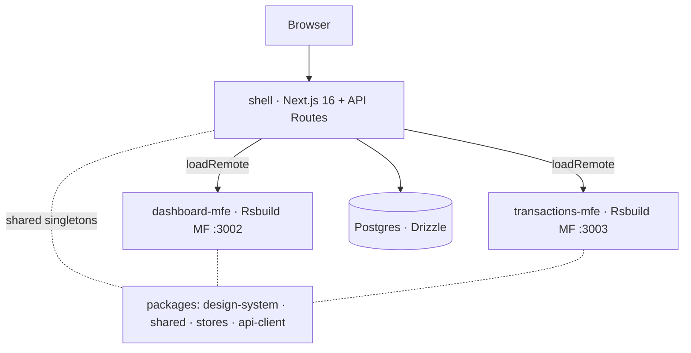

# Task 13 — README raiz + READMEs por package

|                        |                                                                   |
| ---------------------- | ----------------------------------------------------------------- |
| **Sprint**             | [Sprint 4 — Deploy + Polish + Demo](../sprint-4-deploy-polish.md) |
| **Owner**              | Dev 1 (raiz) + cada dono escreve o README do seu package          |
| **Duração estimada**   | 1.5 dia                                                           |
| **Branch recomendada** | `dev1/readme-root` + `dev<N>/readme-<package>`                    |
| **Status**             | ⏳ Pendente                                                       |

---

## Dependências

- **O que bloqueia esta tarefa:** praticamente **todas as tasks 01–12** — o README só está completo quando Docker, deploy, A11y, perf e E2E existem para serem documentados. O esqueleto pode começar antes; os links e números entram quando as tasks fecham.
- **O que esta tarefa desbloqueia:** o **entregável "repo com README completo"** (aceite da Fase 2: "um dev novo clona e roda sem ajuda"). É pré-requisito do roteiro do [vídeo (Task 14)](./14-video-demo.md) e da [retrospectiva (Task 15)](./15-buffer-retro.md).

---

## Contexto

A banca avalia o repositório por este README. Ele precisa permitir clonar e rodar (dev e Docker), explicar a arquitetura de microfrontends e justificar as decisões técnicas.

---

## README raiz (`tech-challenge/README.md`)

- [ ] Header + screenshots.
- [ ] Stack overview com badges (Next 16, TS, Tailwind v4, Module Federation, Redux + TanStack Query, NextAuth, Drizzle/Postgres, Recharts).
- [ ] **Arquitetura:** diagrama (Mermaid) shell + 2 MFEs + 4 packages, mostrando o fluxo de federation e os singletons compartilhados.
- [ ] **Como rodar localmente:**
  - Pré-reqs: Node 22+, npm, Docker (opcional).
  - `cp apps/shell/.env.example apps/shell/.env.local` + `DATABASE_URL`, `NEXTAUTH_SECRET`, `BLOB_READ_WRITE_TOKEN`, `NEXT_PUBLIC_*_MFE_URL`.
  - `npm install` → `docker compose up -d db` → `npm run db:migrate -w @bytebank/shell` → `npm run db:seed -w @bytebank/shell` → `npm run dev`.
  - Alternativa containerizada: `docker compose up --build`.
- [ ] **Deploy:** projetos Vercel (shell + 2 MFEs), env vars, `MFE_ORIGIN`/`NEXT_PUBLIC_*_MFE_URL`, preview encadeado (ver Task 03).
- [ ] **Decisões técnicas:** link para cada doc de sprint; justificar MF (Module Federation runtime), state split (Redux + TanStack Query), charts (Recharts), auth (NextAuth).
- [ ] **Scripts:** `dev`, `build`, `lint`, `test`, `storybook`, `format`.
- [ ] **Estrutura do monorepo:** árvore resumida (`apps/*`, `packages/*`).
- [ ] **Links:** vídeo demo, live deploys, Storybook (Chromatic), `a11y-audit.md`, `perf-audit.md`.

### Diagrama (exemplo Mermaid)

## README por package (dono de cada track)

- [ ] `apps/shell/README.md` — propósito, scripts, env vars, rotas `/api/*`, Proxy de auth. **(Dev 1)**
- [ ] `apps/dashboard-mfe/README.md` — o que expõe (`Dashboard`), como consome o summary, charts. **(Dev 3)**
- [ ] `apps/transactions-mfe/README.md` — expõe `TransactionsPage` + `AccountOverview`; busca/filtros/paginação/categorias/anexos. **(Dev 3)**
- [ ] `packages/design-system/README.md` — componentes, tokens, como adicionar novos, Storybook/Chromatic. **(Dev 2)**
- [ ] `packages/api-client/README.md` — hooks exportados (`useTransactions`, `usePaginatedTransactions`, mutations…). **(Dev 1/3)**
- [ ] `packages/stores/README.md` — `uiSlice`/`authSlice`, quando usar Redux vs TanStack Query. **(Dev 1/3)**
- [ ] `packages/shared/README.md` — types, constants, `suggestCategory`, schema Zod. **(Dev 1)**

---

## Validação (critério de aceite da Fase 2)

- [ ] Um dev que nunca viu o repo clona, segue o README e roda em dev **e** via Docker sem ajuda.
- [ ] Diagrama de arquitetura renderiza no GitHub.
- [ ] Todos os links (deploys, vídeo, Storybook, docs) válidos.
- [ ] Cada package tem README com propósito + como usar.

---

## Gotchas

1. **README mente rápido** — gerar os comandos copiando do que de fato roda (Task 06/03), não de memória.
2. **`.env.example` precisa estar sincronizado** com o que o código lê hoje (`federation.ts`, `db/index.ts`, auth).
3. **Mermaid no GitHub** renderiza nativo; evitar sintaxe que o GitHub não suporta.
4. **Não repetir o PLAN inteiro** — o README aponta para os docs de sprint, não os duplica.
