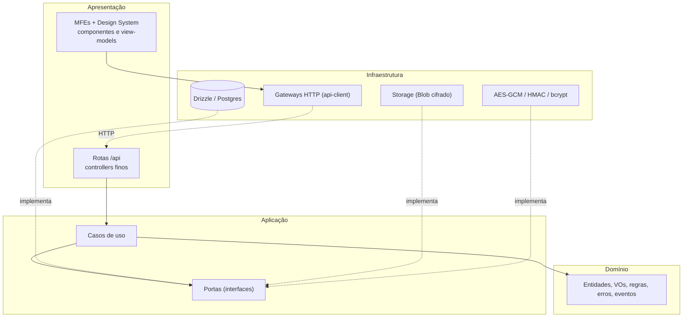

# Tech Challenge — Fase 4 — Plano Geral (40 dias)

**App:** Bytebank — gerenciador financeiro web (shell Next.js 16 + microfrontends)
**Janela:** 2026-09-21 → 2026-10-30 (40 dias corridos, ~6 semanas) · **prazo final 30/10**
**Time:** **3 desenvolvedores** (3 tracks paralelos — ver [team-allocation.md](./team-allocation.md))
**Repo:** **este monorepo** (evolução da Fase 2). Integração na branch `phase-4`; a `main` recebe o merge no fim.

> Este documento é o resumo executivo. Cada sprint tem uma pasta com `README.md` e um arquivo por task:
>
> - [team-allocation.md](./team-allocation.md) — alocação por dev em cada sprint + dependências
> - [sprint-0-foundation/](./sprint-0-foundation/README.md) — correções críticas, baseline, ADRs, spikes (dias 1-5)
> - [sprint-1-clean-architecture/](./sprint-1-clean-architecture/README.md) — domínio, casos de uso, infraestrutura, camadas no front (dias 6-14)
> - [sprint-2-state-reactive/](./sprint-2-state-reactive/README.md) — RxJS, Redux avançado, autenticação segura, preload/lazy (dias 15-23)
> - [sprint-3-cache-security/](./sprint-3-cache-security/README.md) — criptografia, cache em camadas, CSP/CSRF, CI de segurança (dias 24-32)
> - [sprint-4-audit-delivery/](./sprint-4-audit-delivery/README.md) — auditoria OWASP, relatórios, README, vídeo, release (dias 33-40)

---

## Objetivo da Fase 4

> "Nesta fase, o desafio é evoluir a aplicação de gerenciamento financeiro desenvolvida nas fases anteriores, incorporando os novos conceitos aprendidos, como padrões avançados de arquitetura front-end, Clean Architecture, segurança, performance e desenvolvimento mobile. [...] O foco é garantir que a aplicação seja mais escalável, modular, segura e performática, mantendo a experiência do usuário intuitiva e fluida."
> — POSTECH Tech Challenge Fase 4 (PDF, p.2)

O time escolheu evoluir a **versão web (Fases 1 e 2)**, não o app mobile da Fase 3. Não é um projeto novo: é **refatoração e endurecimento** de um sistema que já está em produção. Por isso toda mudança é incremental (padrão Strangler Fig), com testes de contrato e E2E protegendo o comportamento da Fase 2.

## Requisitos da spec → como atendemos

| Requisito (PDF)                                              | Como atendemos                                                                                                                                                       | Onde                                      |
| ------------------------------------------------------------ | -------------------------------------------------------------------------------------------------------------------------------------------------------------------- | ----------------------------------------- |
| Padrões de arquitetura modular                               | Novo pacote `@bytebank/core`; MFEs em camadas; Design System em Atomic Design; fronteiras de módulo verificadas por lint; contrato de navegação e eventos entre MFEs | S1-01, S1-06, S1-08, S1-09, S3-08         |
| State Management Patterns avançados                          | Normalização (entity adapter), seletores memoizados, listener middleware, máquina de estados, atualização otimista, taxonomia de estado (ADR)                        | S0-05, S2-04, S3-06, S3-07                |
| Clean Architecture (apresentação / domínio / infraestrutura) | Domínio e casos de uso em TS puro; portas + adaptadores (Drizzle, Blob, cripto); rotas finas; view-models no front                                                   | S1-01 → S1-07                             |
| Lazy loading e pré-carregamento                              | `preloadRemote` do Module Federation, `prefetchQuery`, prefetch no SSR com `HydrationBoundary`, gráficos sob demanda, subpath `/charts`                              | S2-08, S2-09, S3-04                       |
| Cache para otimizar requisições                              | ETag/304 + `Cache-Control`, cache no servidor por usuário com invalidação por tag, política de cache do TanStack, assets `immutable`                                 | S3-03, S3-04, S3-06                       |
| Programação reativa                                          | RxJS em busca/filtros (debounce, distinct, cancelamento), fila de uploads (progresso, concorrência, retry), inatividade → logout, barramento de eventos entre MFEs   | S2-01, S2-02, S2-03, S2-07, S3-08         |
| Autenticação segura                                          | Correção de IDOR, validação estrita, limite de tentativas e bloqueio, senhas vazadas (HIBP), expiração e revogação de sessão, CSP/CSRF, MFA (plus)                   | S0-02, S0-03, S2-05 → S2-07, S3-05, S3-10 |
| Criptografia de dados sensíveis                              | AES-256-GCM nos anexos (em repouso) com download autenticado; e-mail e nome cifrados com blind index; HSTS (em trânsito)                                             | S3-01, S3-02, S3-05                       |
| Melhoria no tempo de resposta                                | Índices, agregações em SQL, endpoint de overview (fim do "busca tudo" na home), relatório antes/depois                                                               | S0-04, S1-05, S4-04                       |
| README (tecnologias + como rodar localmente)                 | README atualizado com novas variáveis, migrações, segurança e resultados                                                                                             | S4-07                                     |
| Vídeo de até 5 min                                           | Roteiro organizado por requisito                                                                                                                                     | S4-08                                     |

---

## Ponto de partida (auditoria do código, 19–21/09)

| Área          | O que já temos (Fase 2)                                                                     | Lacuna encontrada                                                                                                                                                                                                                                              | Task                       |
| ------------- | ------------------------------------------------------------------------------------------- | -------------------------------------------------------------------------------------------------------------------------------------------------------------------------------------------------------------------------------------------------------------- | -------------------------- |
| Autorização   | Lista, resumo e anexos filtram por `userId`                                                 | 🔴 `GET/PATCH/DELETE /api/transactions/[id]` não conferem o dono, e o `PATCH` aceita `userId` no corpo (IDOR — OWASP API1:2023). **Está em produção.**                                                                                                         | S0-02                      |
| Validação     | Zod nos formulários                                                                         | `POST`/`PATCH` gravam o corpo sem validar no servidor; o cliente envia `userId: 'joana'`; a coluna `user_id` tem default `'joana'`                                                                                                                             | S0-03                      |
| Camadas       | `StorageProvider` já é porta + adaptador                                                    | Rotas chamam o Drizzle direto (`store.ts`); regras em componente (`Dashboard.tsx`) e em rota (`summary`); `@bytebank/shared` mistura domínio com utilitários de UI; o parsing de filtros existe duas vezes (cliente e servidor)                                | S1-01 → S1-07              |
| Estado        | TanStack (servidor) + Redux (UI), exclusão otimista                                         | Sem normalização, seletores memoizados ou efeitos centralizados; fluxo de nova transação controlado por vários booleans; Redux DevTools ligado em produção                                                                                                     | S2-04, S3-06, S3-07        |
| Reatividade   | —                                                                                           | Nenhuma (a busca usa `setTimeout`)                                                                                                                                                                                                                             | S2-01 → S2-03              |
| Performance   | MFEs com `next/dynamic`, `DeferUntilVisible`, modais lazy, preconnect/preload dos manifests | Mobile abaixo da meta na Fase 2 (`/` 67, `/transactions` 72 — meta 85); `import * as DS` em `lib/federation.ts` leva o **recharts** para toda página federada; a home baixa **todas** as transações para mostrar saldo + 5 recentes; nenhum índice no Postgres | S1-05, S2-08, S2-09, S3-04 |
| Cache         | TanStack em memória (60 s)                                                                  | Sem cache HTTP (ETag) nem cache no servidor                                                                                                                                                                                                                    | S3-03, S3-04, S3-06        |
| Autenticação  | NextAuth v5 (JWT em cookie HttpOnly), bcrypt custo 10, Google OAuth                         | Sem limite de tentativas; senha mínima de 8 sem checagem de vazamento; sessão de 7 dias sem revogação; logout não limpa os caches do cliente                                                                                                                   | S2-05 → S2-07              |
| Criptografia  | bcrypt para senha                                                                           | Nada cifrado em repouso; anexos no Vercel Blob com `access: 'public'`; MIME confiado no `file.type` do cliente; nome original do arquivo na chave do blob                                                                                                      | S3-01, S3-02               |
| Borda e infra | CORS restrito nos anexos                                                                    | Sem CSP/HSTS/headers de segurança; container do shell roda como root; Postgres exposto em `0.0.0.0:5432` com senha padrão                                                                                                                                      | S3-05, S4-02               |
| Verificação   | Lint, type-check, testes e E2E na CI                                                        | Sem varredura de dependências, segredos e imagens, nem DAST; token do Chromatic em claro no `package.json` do DS                                                                                                                                               | S3-09, S4-03               |

---

## Decisões (ADR resumido)

| Decisão             | Escolha                                                                                                                                                                         | Justificativa                                                                                           |
| ------------------- | ------------------------------------------------------------------------------------------------------------------------------------------------------------------------------- | ------------------------------------------------------------------------------------------------------- |
| Base da fase        | **Web (monorepo da Fase 2)**                                                                                                                                                    | Já está em produção e tem mais superfície para arquitetura, cache e segurança, que são o foco da Fase 4 |
| Organização modular | Monorepo Turborepo + 2 MFEs (mantidos) + **novo `@bytebank/core`**                                                                                                              | Domínio e casos de uso compartilhados por servidor e clientes, sem dependência de framework             |
| Clean Architecture  | Domínio + aplicação no core; infraestrutura no shell (`src/server/infrastructure`) e no `api-client` (gateways); apresentação = rotas finas, páginas, componentes e view-models | Regra de dependência verificável por lint (S1-08)                                                       |
| Migração            | **Strangler Fig**: `@bytebank/shared` reexporta do core enquanto o código migra                                                                                                 | Refatoração incremental sem quebrar a Fase 2                                                            |
| Estado do servidor  | **TanStack Query** (mantido) + prefetch/hydration + atualização otimista                                                                                                        | Já é a fonte de verdade dos dados remotos; não duplicar no Redux                                        |
| Estado do cliente   | **Redux Toolkit** com `createEntityAdapter`, `createSelector` e `createListenerMiddleware`                                                                                      | Padrões avançados pedidos pela spec, sem dependência nova                                               |
| Fluxos multi-etapa  | **Máquina de estados** com `useReducer` + união discriminada                                                                                                                    | Elimina o controle por vários booleans; testável por tabela de transições                               |
| Programação reativa | **RxJS 7**, compartilhado como singleton na federação                                                                                                                           | Padrão de mercado; os operadores resolvem debounce, cancelamento, concorrência e retry                  |
| Pré-carregamento    | `preloadRemote` (MF runtime 2.5), `prefetchQuery`, prefetch no SSR com `HydrationBoundary`                                                                                      | Ataca a cascata `ssr:false` + federação apontada na Fase 2                                              |
| Cache               | ETag/304 + `Cache-Control: private`; cache por usuário no servidor com tags; política por tipo de dado no TanStack; assets `immutable`                                          | Cache em camadas sem expor dados de um usuário a outro                                                  |
| Criptografia        | **AES-256-GCM** (`node:crypto`) com chave versionada; **HMAC-SHA256** (blind index); bcrypt custo 12                                                                            | GCM detecta adulteração; o blind index permite login sem e-mail em claro no banco                       |
| Autenticação        | NextAuth v5 (mantido) + rate limit/bloqueio em Postgres + HIBP + `sessionVersion` + logout por inatividade; MFA TOTP como plus                                                  | Cobre força bruta, credenciais vazadas, sequestro de sessão e logout adequado                           |
| Borda               | Headers de segurança + **CSP com nonce** (Report-Only → enforce) + checagem de `Origin` nas mutações                                                                            | Mitiga XSS e CSRF                                                                                       |
| Verificação         | Vitest, Playwright, `npm audit`, Dependabot, CodeQL/Semgrep, gitleaks, Trivy, **OWASP ZAP**                                                                                     | Ferramentas das aulas de OWASP e de verificação de vulnerabilidades                                     |

### Alternativas avaliadas

| Alternativa                                            | Motivo de não escolha                                                                                              |
| ------------------------------------------------------ | ------------------------------------------------------------------------------------------------------------------ |
| Evoluir o app mobile (Fase 3)                          | Decisão do time: a web tem mais superfície para os requisitos desta fase                                           |
| GraphQL (Arquiteturas Avançadas, Aula 6)               | Não é requisito; REST + TanStack já resolvem; aumentaria o escopo e a superfície de ataque                         |
| XState                                                 | Resolve, mas adiciona dependência e curva de aprendizado; o fluxo é pequeno para um reducer tipado                 |
| Upstash/Redis para rate limit                          | Serviço externo a mais; o Postgres já existe e funciona igual em Docker, CI e Vercel                               |
| Persistir o cache do TanStack (localStorage/IndexedDB) | Deixaria dados financeiros em claro no dispositivo, o que conflita com o requisito de segurança                    |
| SSR real dos MFEs                                      | Mudança arquitetural grande (MF + RSC); prefetch no SSR + preload entregam boa parte do ganho                      |
| `pgcrypto` no banco                                    | A chave teria de trafegar nas queries; cifrar na aplicação mantém a chave fora do banco                            |
| Cifrar `description`/`amount`                          | Quebraria a busca `ilike` e os filtros/ordenação por valor em SQL; ficam em claro por decisão registrada (ADR-004) |

---

## Arquitetura alvo

```
tech-challenge/
├── apps/
│   ├── shell/                          ← Next.js 16 (host + BFF)
│   │   └── src/
│   │       ├── app/                    ← apresentação: páginas (RSC) + rotas /api (controllers finos)
│   │       ├── server/
│   │       │   ├── http/               ← adaptador HTTP: route(), mapeamento de erros, ETag
│   │       │   ├── infrastructure/     ← repositórios Drizzle, storage (Blob/local), AES-GCM, bcrypt, rate limiter, logger
│   │       │   └── container.ts        ← composition root (injeção de dependências)
│   │       ├── db/                     ← schema + migrações (Drizzle)
│   │       ├── lib/federation.ts       ← runtime do Module Federation + preload
│   │       └── proxy.ts                ← autenticação de borda, CSP com nonce, checagem de Origin
│   ├── dashboard-mfe/src/{presentation,application}/
│   └── transactions-mfe/src/{presentation,application,infrastructure}/
├── packages/
│   ├── core/            ← NOVO — TS puro: domain/ (entidades, VOs, regras, erros, eventos) + application/ (portas, casos de uso)
│   ├── api-client/      ← infraestrutura do cliente: gateways HTTP + queries do TanStack
│   ├── stores/          ← estado do cliente: Redux (slices, seletores, listeners) + barramento RxJS + hooks reativos
│   ├── design-system/   ← apresentação: atoms/molecules/organisms/templates (+ subpath /charts)
│   └── shared/          ← legado em extinção (strangler): reexporta do core + utilitários de UI
└── docs/phase-4/
```



**Regra de dependência:** domínio não importa nada de framework nem de IO; aplicação depende só do domínio e das próprias portas; infraestrutura implementa portas; apresentação chama casos de uso (no servidor) ou hooks/view-models (no cliente). Quem liga tudo é o composition root (`container.ts` no shell, `bootstrap.tsx` nos MFEs). O lint quebra o build se a regra for violada (S1-08).

### Segurança — controles por camada

| Camada             | Controles                                                                                                                                             |
| ------------------ | ----------------------------------------------------------------------------------------------------------------------------------------------------- |
| Navegador          | CSP com nonce, HSTS, cookies `HttpOnly`/`Secure`/`SameSite=Lax`, nenhum token em JS ou `localStorage`, logout limpa os caches, logout por inatividade |
| Borda (`proxy.ts`) | Sessão obrigatória fora das rotas públicas, checagem de `Origin` em mutações, headers de segurança                                                    |
| Aplicação          | Autorização por dono em todo caso de uso, validação estrita (`z.strictObject`), erros genéricos, rate limit e bloqueio, HIBP, revogação de sessão     |
| Dados              | AES-256-GCM (anexos, e-mail, nome) com AAD por registro, blind index, chaves versionadas fora do repo, usuário de banco com privilégio mínimo         |
| Arquivos           | Tamanho máximo, tipo detectado por magic bytes, chave aleatória no storage, download só por rota autenticada com `Content-Disposition` seguro         |
| Pipeline           | `npm audit` como gate, Dependabot, CodeQL/Semgrep, gitleaks, Trivy, ZAP                                                                               |

### Estado — taxonomia

| Tipo de estado      | Onde vive                                | Padrões                                                                    |
| ------------------- | ---------------------------------------- | -------------------------------------------------------------------------- |
| Dados do servidor   | TanStack Query                           | cache por chave, prefetch, hydration, otimista, `select`                   |
| Global do cliente   | Redux Toolkit                            | entity adapter, seletores memoizados, listener middleware, reset no logout |
| URL                 | `TransactionFilter` + `UrlFilterStorage` | codec único para cliente e servidor                                        |
| Formulários         | React Hook Form + Zod                    | schemas do core                                                            |
| Fluxos multi-etapa  | Máquina de estados (reducer)             | transições explícitas                                                      |
| Eventos e streams   | RxJS                                     | barramento de eventos de domínio, fila de uploads, inatividade             |
| Local de componente | `useState`                               | —                                                                          |

### Cache — camadas

| Camada             | O quê                                                                                                               | Invalidação                                              |
| ------------------ | ------------------------------------------------------------------------------------------------------------------- | -------------------------------------------------------- |
| Navegador (assets) | Chunks com hash dos MFEs e `_next/static` → `immutable` por 1 ano; `mf-manifest.json`/`remoteEntry.js` → `no-cache` | Novo deploy = novo hash                                  |
| Navegador (API)    | ETag + `Cache-Control: private, no-cache` → `304 Not Modified`                                                      | Versão dos dados do usuário (`max(updated_at)`, `count`) |
| Servidor           | Resumo do dashboard por usuário (tag `summary:{userId}`)                                                            | Mutações chamam a porta `CacheInvalidator`               |
| Cliente (memória)  | TanStack com `staleTime` por tipo de dado                                                                           | Mutações invalidam chaves; logout limpa tudo             |
| (Não fazemos)      | Persistir dados financeiros no dispositivo                                                                          | —                                                        |

### Metas (KPIs)

| Métrica                                     | Ponto de partida             | Meta da Fase 4                            |
| ------------------------------------------- | ---------------------------- | ----------------------------------------- |
| Lighthouse mobile `/`                       | 67 (Fase 2, local best-of-3) | **≥ 85**                                  |
| Lighthouse mobile `/transactions`           | 72                           | **≥ 85**                                  |
| Lighthouse desktop (todas)                  | 97–100                       | ≥ 95 (sem regressão), CLS = 0             |
| recharts no carregamento de `/transactions` | sim (~138 KB gzip)           | **não**                                   |
| p95 do resumo e da lista (5 mil transações) | medir no S0-04               | **−50%**                                  |
| Payload da home                             | lista completa               | saldo + 5 recentes                        |
| Requisições por termo de busca              | medir no S0-04               | 1 por termo estável; obsoletas canceladas |
| ZAP baseline                                | —                            | 0 achados High                            |
| `npm audit` (dependências de produção)      | medir                        | 0 High/Critical                           |
| Rotas com autorização testada               | parcial                      | 100%                                      |
| Cobertura de linhas do `@bytebank/core`     | —                            | ≥ 90%                                     |

---

## Embasamento: aulas da fase → onde aplicamos

| Módulo · Aula                                                         | Uso no projeto                                                                                                             | Tasks                                           |
| --------------------------------------------------------------------- | -------------------------------------------------------------------------------------------------------------------------- | ----------------------------------------------- |
| **Princípios e Padrões de Arquitetura em Frontend**                   |                                                                                                                            |                                                 |
| Aula 1 — Panorama das arquiteturas                                    | Contexto do ADR-001 (monólito modular × MFE × camadas)                                                                     | S0-05                                           |
| Aula 2 — Padrões de projeto                                           | Repository, Adapter, Facade (gateways), Decorator (cache), Observer (barramento), State (FSM), composition root            | S1-02, S1-03, S1-06, S2-01, S3-04, S3-07        |
| Aula 3 — Componentização e arquitetura modular                        | Pacote core, camadas nos MFEs, fronteiras por lint, contrato entre MFEs                                                    | S1-01, S1-06, S1-08, S3-08                      |
| Aula 4 — State Management Patterns                                    | Entity adapter, seletores, listeners, otimista, FSM, taxonomia                                                             | S0-05, S2-04, S3-06, S3-07                      |
| Aula 5 — Arquiteturas CSS                                             | Atomic Design no DS; documento da arquitetura CSS (Tailwind v4 + tokens × BEM/CSS Modules/CSS-in-JS)                       | S1-09                                           |
| Aula 6 — Comparativo de arquiteturas                                  | Alternativas avaliadas nos ADRs                                                                                            | S0-05                                           |
| **Arquiteturas Avançadas e Clean Architecture para Web**              |                                                                                                                            |                                                 |
| Aula 1 — Clean Architecture para Web                                  | Domínio, aplicação, infraestrutura e apresentação separados                                                                | S1-01 → S1-07                                   |
| Aula 2 — Estratégias de refatoração                                   | Strangler Fig, testes de contrato, lint primeiro como aviso e depois como erro                                             | S1-01, S1-04, S1-08                             |
| Aula 3 — Programação reativa                                          | RxJS: busca, uploads, inatividade, eventos entre MFEs                                                                      | S2-01, S2-02, S2-03, S2-07, S3-08               |
| Aula 4 — Performance                                                  | Baseline, índices/SQL, preload, lazy, cache, relatório                                                                     | S0-04, S1-05, S2-08, S2-09, S3-03, S3-04, S4-04 |
| Aula 5 — Arquitetura web com cloud                                    | Cache de borda/CDN na Vercel, responsabilidade compartilhada (Vercel/Neon), deploy coordenado                              | S3-03, S4-09                                    |
| Aula 6 — GraphQL                                                      | Não aplicado (justificado nas alternativas)                                                                                | —                                               |
| **Desenvolvendo Aplicações Mobile**                                   | Não aplicado: a fase evolui a web. A aula de segurança mobile reforça o ADR-005 (não persistir dado financeiro no cliente) | —                                               |
| **Desenvolvimento Seguro**                                            |                                                                                                                            |                                                 |
| Aula 1 — Princípios (confidencialidade, integridade, disponibilidade) | Justificativa do ADR-004: cifra (confidencialidade), tag do GCM (integridade), rate limit (disponibilidade)                | S0-05, S3-01                                    |
| Aula 2 — Codificação segura                                           | Validação estrita, magic bytes, nomes sanitizados, erros genéricos                                                         | S0-03, S1-04, S3-01                             |
| Aula 3 — Codificação segura na autenticação                           | Força bruta (limite, atraso), senhas vazadas (HIBP), expiração, logout adequado, cookies seguros, OAuth/OIDC, MFA          | S2-05, S2-06, S2-07, S3-10                      |
| Aula 4 — OWASP e OWASP Top 10                                         | IDOR (A01/API1), mass assignment (API3), XSS (CSP), CSRF, logs (A09), ZAP                                                  | S0-02, S0-03, S3-05, S4-01, S4-03               |
| Aula 5 — Segurança nos servidores                                     | Container não-root, portas, menor privilégio no banco, HSTS, gestão de chaves                                              | S3-01, S3-05, S4-02                             |
| Aula 6 — Padrões de segurança                                         | Defesa em profundidade, menor privilégio, falhar de forma segura, zero trust entre MFEs                                    | S1-04, S3-05, S4-02                             |
| Aula 7 — Verificação de vulnerabilidades                              | `npm audit`, Dependabot, CodeQL/Semgrep, gitleaks, Trivy, ZAP; bcrypt com custo maior                                      | S2-06, S3-09, S4-03                             |

---

## Custos & free tier

Nenhum serviço pago novo. Tudo o que entra nesta fase é open source ou tem nível gratuito suficiente:

| Ferramenta                                      | Nível gratuito                                  | Observação                                                                                             |
| ----------------------------------------------- | ----------------------------------------------- | ------------------------------------------------------------------------------------------------------ |
| RxJS, Zod, Redux Toolkit, TanStack Query        | Open source                                     | —                                                                                                      |
| HIBP Pwned Passwords (API de faixa/k-anonymity) | Gratuita, sem chave                             | Só os 5 primeiros caracteres do hash saem do servidor                                                  |
| OWASP ZAP, Trivy, Semgrep OSS, gitleaks (CLI)   | Open source                                     | A GitHub Action oficial do gitleaks pede licença gratuita para organizações; a CLI via Docker não pede |
| CodeQL                                          | Grátis em repositório público                   | Se o repo for privado, o Semgrep cobre o SAST                                                          |
| Dependabot, GitHub Actions                      | Grátis (repo público) / 2.000 min/mês (privado) | —                                                                                                      |
| Vercel (Hobby), Neon (free), Vercel Blob        | Já em uso                                       | Sem mudança de plano                                                                                   |

---

## Roadmap visual

```
Set                          Out
21   26            05            14            23        30
[S0]  Fundação (5d)
     [──S1 Clean Architecture (9d)──]
                   [──S2 Estado, reatividade e auth (9d)──]
                                 [──S3 Cache e criptografia (9d)──]
                                               [S4 Auditoria e entrega (8d)]
```

| Sprint | Foco                                                                    | Dias | Datas         |
| ------ | ----------------------------------------------------------------------- | ---- | ------------- |
| **0**  | Fundação: IDOR, validação, baseline, ADRs, spikes                       | 5    | 21/09 → 25/09 |
| **1**  | Clean Architecture e modularização                                      | 9    | 26/09 → 04/10 |
| **2**  | Estado avançado, programação reativa, autenticação segura, preload/lazy | 9    | 05/10 → 13/10 |
| **3**  | Criptografia, cache em camadas, CSP/CSRF, CI de segurança               | 9    | 14/10 → 22/10 |
| **4**  | Auditoria, relatórios, documentação, vídeo e release                    | 8    | 23/10 → 30/10 |

**Capacidade:** 3 devs × 40 dias = 120 dev-days nominais. Planejado: ~65 dev-days (~54%) + 2 de plus (P2). A folga absorve code review, pair, imprevistos e os estudos da fase.

---

## Convenções obrigatórias (toda sprint)

1. **Regra de dependência:** domínio sem framework/IO; rotas sem Drizzle direto; apresentação sem infraestrutura direta. O lint verifica.
2. **Todo endpoint:** autenticação + autorização por dono no caso de uso + validação estrita (`z.strictObject`) + erro genérico ao cliente.
3. **Nunca confiar no cliente:** `userId` sempre vem da sessão; tipo de arquivo por magic bytes; filtros e paginação validados.
4. **Segredos só em variáveis de ambiente**, nunca no repo; toda variável nova entra no `.env.example` com instrução de geração.
5. **Estado no lugar certo:** servidor = TanStack; global do cliente = Redux; URL = filtros; fluxos = FSM; eventos = RxJS. Não duplicar dados do servidor no Redux.
6. **RxJS com moderação:** para streams de eventos (input, upload, inatividade, eventos entre MFEs), não para substituir o TanStack.
7. **Performance medida:** task de performance registra antes/depois; dependência pesada nova entra com lazy loading.
8. **Design System primeiro:** componente novo nasce no DS com story no Storybook, na camada certa do Atomic Design.
9. **A11y não regride:** teclado, labels, contraste e `aria-live` nos fluxos novos.
10. **Testes acompanham as features:** core com testes puros; casos de uso com fakes; rotas com testes de contrato; RxJS com marble tests; fluxos críticos no E2E.
11. **Decisão nova de arquitetura → ADR** em `docs/phase-4/adr/`.
12. **PR checklist** (template criado no S0-01): camadas? autorização/validação? testes? segredos? a11y? antes/depois (se performance)?

## Git workflow — Fase 4

`main` = produção (Fase 2 hoje). `phase-4` = branch de integração da fase, criada a partir da `main` no dia 1. Features partem de `phase-4` e os PRs apontam para `phase-4`. A `main` recebe o merge final no fim do Sprint 4 (tag `v4.0.0`).

**Exceção:** a correção do IDOR (S0-02) também vai para a `main` como hotfix, porque a produção está vulnerável. Depois do merge, a `main` é mesclada de volta na `phase-4`.

```bash
git checkout main && git pull
git checkout -b phase-4 && git push -u origin phase-4

git checkout phase-4 && git pull
git checkout -b dev1-sec/idor-fix
gh pr create --base phase-4 --title "fix(api): autorização por dono em /api/transactions/[id]"
```

**Convenção de branch:**

- `dev1-sec/<task>` — Track Backend & Segurança
- `dev2-arch/<task>` — Track Arquitetura Front & Estado
- `dev3-perf/<task>` — Track Performance & Plataforma
- `spike/<nome>` — spikes descartáveis (não mergeiam)

**Regras de merge:** PR com 1 reviewer + CI verde (lint com fronteiras, type-check, testes, build, E2E, gates de segurança). Commits no padrão Conventional Commits. Rebase diário na `phase-4` recomendado.

---

## Riscos & mitigações

| Risco                                                    | Mitigação                                                                                                                                                     |
| -------------------------------------------------------- | ------------------------------------------------------------------------------------------------------------------------------------------------------------- |
| A refatoração do S1 quebra a Fase 2                      | Strangler (`shared` reexporta do core), testes de contrato das rotas, E2E em todo PR, uma fatia por PR (sem big bang)                                         |
| Pacote novo quebra build ou federação                    | Checklist de pacote novo (`transpilePackages`, `shared` do MF no shell e nos MFEs, `COPY` nos Dockerfiles, `tsconfig` composite, projeto no Vitest) + Spike A |
| RxJS duplicado ou instâncias diferentes entre MFEs       | Singleton na federação + Spike A; fallback: barramento via `CustomEvent` + `fromEvent`                                                                        |
| CSP quebra o carregamento dos remotes ou os gráficos     | Report-Only primeiro; `'strict-dynamic'` + nonce; allowlist das origens dos MFEs; `style-src 'unsafe-inline'` documentado; Spike B                            |
| Perda ou vazamento da chave de criptografia              | Chaves só em env Sensitive (Vercel) e `.env.local`; `keyId` versionado; script de rotação; cópia segura fora do repo; testes de adulteração                   |
| Migração de dados em produção (backfill de PII e anexos) | Expand/contract: colunas novas + leitura dupla → backfill → remover as antigas só após verificação; branch/backup do Neon antes                               |
| Rate limit trava os testes E2E                           | Limites configuráveis por env; e-mails de teste únicos; limpeza da tabela no setup do E2E                                                                     |
| HIBP indisponível ou lento                               | Timeout de 2 s + fail-open com log; desligável por env na CI                                                                                                  |
| Cache servindo dado de outro usuário                     | Chave/tag sempre com `userId`; `QueryClient` por requisição no servidor; `Cache-Control: private`; testes com 2 usuários                                      |
| Escopo estoura (40 dias, muitos itens de segurança)      | Prioridades P0/P1/P2; P2 só com folga; P1 cortáveis nesta ordem: DS Atomic (reduzir à hierarquia do Storybook), PII com blind index, FSM, logs                |
| Medição de performance ruidosa                           | Best-of-3, mesma máquina/rede; produção Vercel como fonte principal                                                                                           |
| Vídeo de 5 min não comporta tudo                         | Roteiro por requisito da spec (S4-08), gravação por partes, cortes                                                                                            |
| IDOR já em produção                                      | Hotfix na `main` no S0 (S0-02)                                                                                                                                |

## Verificação end-to-end (final)

1. Clone limpo → seguir só o README → `npm install`, Postgres no Docker, migrações, seed → `npm run dev` sobe shell + MFEs
2. Cadastro exige senha ≥ 12 e recusa senha vazada
3. Login: após 5 senhas erradas, bloqueio temporário com mensagem genérica
4. Usuário B não lê, edita nem exclui transação do usuário A (**404**) — teste automatizado e `curl`
5. `PATCH` com `userId` ou campos extras → **422**
6. Home abre com dados pré-buscados no servidor (sem requisição de dados após o remote montar); passar o mouse em "Transações" pré-carrega o remote (aba Network)
7. Busca: digitar rápido gera 1 requisição; as obsoletas aparecem como canceladas
8. Upload de 3 anexos: progresso por arquivo, no máximo 2 simultâneos, cancelar um, retry automático em falha transitória
9. O arquivo no Blob está cifrado (download direto ilegível); pela aplicação abre normalmente; arquivo com extensão falsa é recusado
10. `psql`: e-mail e nome aparecem cifrados; o login continua funcionando
11. `GET` repetido da API retorna **304** com ETag; depois de criar uma transação, os dados atualizam
12. Inatividade → aviso → logout; o logout limpa o cache do TanStack e o Redux
13. Headers (CSP em modo enforce, HSTS, nosniff, frame-ancestors) conferidos no DevTools; mutação com `Origin` estranho → **403**
14. CI verde: lint (com fronteiras), type-check, testes, build, E2E, `npm audit`, CodeQL/Semgrep, gitleaks, Trivy
15. ZAP baseline sem achados High; auditoria OWASP em `docs/phase-4/security/`
16. Lighthouse mobile ≥ 85 em `/` e `/transactions` (produção, best-of-3)
17. Vídeo ≤ 5 min cobrindo arquitetura, estado/reatividade, performance e segurança

## Próximos passos imediatos

- [ ] Criar a branch `phase-4` a partir da `main` e habilitar a CI nela ([S0-01](./sprint-0-foundation/01-branch-ci-setup.md))
- [ ] Dev 1 começa pelo IDOR ([S0-02](./sprint-0-foundation/02-idor-fix.md)) — prioridade máxima, a produção está vulnerável
- [ ] Dev 3 mede a baseline em produção antes de qualquer otimização ([S0-04](./sprint-0-foundation/04-perf-baseline.md))
- [ ] Dev 2 abre os ADRs para revisão do time até o dia 3 ([S0-05](./sprint-0-foundation/05-architecture-adrs.md))
- [ ] Criar o board (GitHub Projects) com as tasks deste plano
