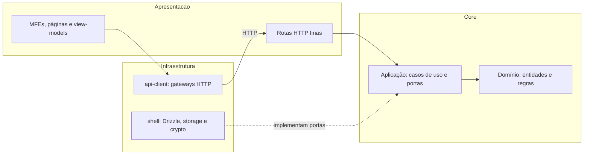

# ADR-001 — Camadas e pacotes da arquitetura alvo

|                 |                                                                           |
| --------------- | ------------------------------------------------------------------------- |
| **Status**      | proposto                                                                  |
| **Data**        | 2026-09-28                                                                |
| **Autor**       | Dev 2 (Arquitetura Front & Estado)                                        |
| **Task**        | [S0-05](../sprint-0-foundation/05-architecture-adrs.md)                   |
| **Embasamento** | Princípios e Padrões — Aulas 1 e 6 · Arquiteturas Avançadas — Aulas 1 e 2 |

---

## Status

Proposto para revisão do Dev 1 e do Dev 3. A aceitação cabe ao [gate S0-07](../sprint-0-foundation/07-gate.md).

## Contexto

O domínio está misturado a utilitários de UI em `packages/shared/src/`, enquanto `apps/shell/src/app/api/transactions/route.ts` acessa `store.ts` diretamente. A Phase 4 precisa compartilhar regras entre o shell e os dois MFEs sem acoplar o domínio a Next.js, React, Drizzle ou storage. A migração deve preservar os contratos da Fase 2 enquanto cada consumidor é movido.

## Decisão

**Usaremos `@bytebank/core` para domínio e aplicação em TypeScript puro, com infraestrutura nas bordas e apresentação como cliente dos casos de uso.**

- `packages/core/src/domain/` contém entidades, value objects, regras, erros e eventos; `application/` contém casos de uso e portas. Validação pura com Zod é permitida em `schemas/`; o core não importa React, Next.js, Drizzle, `node:*`, IO nem outros pacotes `@bytebank/*`.
- `apps/shell/src/server/infrastructure/` implementa persistência, storage e criptografia; `packages/api-client/` implementa gateways HTTP do cliente. Rotas `/api` autenticam, validam e traduzem HTTP para casos de uso. Páginas, componentes e view-models compõem a apresentação.
- `apps/shell/src/server/container.ts` liga portas e adaptadores no servidor; os `bootstrap.tsx` dos MFEs ligam dependências do cliente. `@bytebank/shared` reexporta símbolos migrados do core temporariamente e retém apenas utilitários de apresentação. [S1-01](../sprint-1-clean-architecture/01-core-domain.md) inicia a migração; [S1-08](../sprint-1-clean-architecture/08-module-boundaries.md) torna a regra verificável no lint e no CI.

As setas sólidas representam chamadas; a seta pontilhada representa implementação de portas. O core não depende dos adaptadores. Manteremos REST: GraphQL não resolve um requisito pendente que justifique outro contrato e outra superfície de segurança.

## Alternativas consideradas

| Alternativa                             | Por que não                                                                                               |
| --------------------------------------- | --------------------------------------------------------------------------------------------------------- |
| Continuar ampliando `@bytebank/shared`  | Mistura regras de domínio com UI e dificulta impor fronteiras.                                            |
| Migrar todos os consumidores de uma vez | Aumenta risco de regressão durante a evolução da Fase 2; reexports permitem passos verificáveis.          |
| Introduzir GraphQL junto com as camadas | REST e TanStack já atendem às consultas previstas; o novo contrato elevaria custo e superfície de ataque. |

## Consequências

**Positivas:** regras puras podem ser testadas sem framework; rotas e MFEs compartilham contratos; lint consegue detectar importações invertidas.

**Negativas / trade-offs:** portas, adaptadores e composition roots adicionam arquivos e mapeamentos; os reexports do `shared` mantêm duas entradas temporárias para o mesmo símbolo.

**Follow-ups:** S1-01 a S1-04 migram domínio e rotas; S1-06 migra os MFEs; S1-08 impõe as fronteiras. Remover reexports somente depois de migrar os imports.

## Referências

- Aulas da fase: Princípios e Padrões — Aulas 1 e 6; Arquiteturas Avançadas — Aulas 1 e 2.
- Plano: [arquitetura alvo](../PLAN.md#arquitetura-alvo).
- Código atual: `packages/shared/src/index.ts`, `apps/shell/src/app/api/transactions/route.ts`, `apps/shell/src/app/api/transactions/store.ts`.
