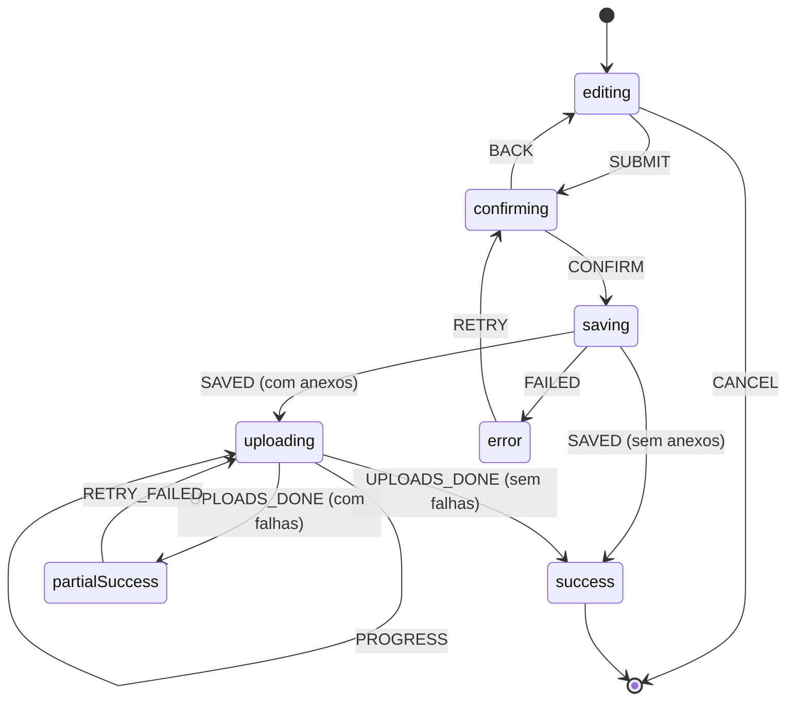

# Task 07 — Máquina de estados do fluxo de transação

|                 |                                                                                   |
| --------------- | --------------------------------------------------------------------------------- |
| **Sprint**      | [Sprint 3 — Cache e criptografia](./README.md)                                    |
| **Owner**       | Dev 2 (Arquitetura Front & Estado)                                                |
| **Duração**     | 1.5 dia                                                                           |
| **Prioridade**  | P1                                                                                |
| **Branch**      | `dev2-arch/transaction-flow-fsm`                                                  |
| **Depende de**  | S2-03 (fila de uploads), S1-07 (`saveTransactionWithAttachments`)                 |
| **Desbloqueia** | S4-06 (diagrama de estados na documentação)                                       |
| **Requisito**   | State Management Patterns avançados                                               |
| **Embasamento** | Princípios e Padrões — Aula 2 (padrão State) e Aula 4 (State Management Patterns) |

---

## Contexto

O `NewTransactionModal` controla o fluxo com `pendingData`, `isSubmitting` e o estado do `useAttachments`: combinações inválidas são possíveis (confirmar duas vezes, fechar no meio do upload) e cada tela reimplementa o fluxo. Uma máquina de estados torna os estados e as transições explícitos e testáveis.

## Estados



## Implementação

1. **Reducer puro** (`application/` do transactions-mfe), com união discriminada:

   ```ts
   type FlowState =
     | { value: 'editing' }
     | { value: 'confirming'; draft: TransactionFormValues }
     | { value: 'saving'; draft: TransactionFormValues }
     | { value: 'uploading'; transactionId: string; done: number; total: number }
     | { value: 'partialSuccess'; transactionId: string; failed: File[] }
     | { value: 'success' }
     | { value: 'error'; draft: TransactionFormValues; reason: string };

   export function transactionFlow(state: FlowState, event: FlowEvent): FlowState {
     switch (state.value) {
       case 'editing':
         return event.type === 'SUBMIT' ? { value: 'confirming', draft: event.draft } : state;
       case 'confirming':
         if (event.type === 'CONFIRM') return { value: 'saving', draft: state.draft };
         if (event.type === 'BACK') return { value: 'editing' };
         return state;
       // ...demais estados
     }
   }
   ```

2. **Hook `useTransactionFlow()`:** junta o reducer com os efeitos — ao entrar em `saving`, chama o caso de uso; em `uploading`, assina a fila (S2-03) e despacha `PROGRESS`/`UPLOADS_DONE`. A UI só lê `state.value` e envia eventos.
3. **UI:** modal de confirmação aberto em `confirming` e `saving`; barra de progresso em `uploading`; botão "Tentar de novo" em `partialSuccess`; anúncios com `aria-live="polite"` a cada mudança de estado.
4. Aplicar em `NewTransactionModal` e `EditTransactionModal`.

## Testes

- [ ] Tabela de transições: todas as válidas; eventos inválidos ignorados (mesmo estado)
- [ ] Hook com caso de uso e uploader falsos: sucesso, falha parcial com retry, erro com retry

## Validação

- [ ] Duplo clique em "Confirmar" cria uma única transação
- [ ] Falha parcial de upload mostra o que falhou e permite tentar de novo
- [ ] Leitor de tela anuncia "Salvando…", "Enviando anexos 1 de 3", "Transação criada"

## Gotchas

1. Transição inválida devolve o mesmo estado — é isso que evita o duplo submit.
2. Efeitos ficam fora do reducer (reducer puro). No StrictMode o efeito roda duas vezes em dev: use um id de execução para não criar a transação duas vezes.
3. Cancelar durante `uploading` cancela a assinatura da fila, mas a transação já existe: leve o usuário para `partialSuccess` com a explicação.
